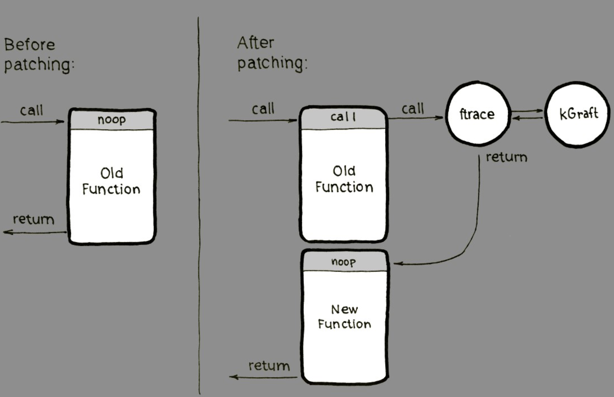

{: .-three-column}

### kgr Tool - query and manipulate kGraft patching status
Display the overall status of kGraft patching (ready or in_progress)
```bash
$ kgr status
## Example output
ready
```
Display the list of loaded kGraft patches
```bash
$ kgr -v patches
## Example Output
kgraft_patch_1_8_5_1
    active: 1
    RPM: kgraft-patch-4_12_14-122_46-default-1-8.5.1.x86_64
    CVE: (none - this is an initial kGraft patch)
    bug fixes and enhancements: (none)
```

List processes that are preventing kGraft patching from finishing. 
By default, only the PIDs are listed
```bash
$ kgr -v blocking
## Example Output
no processes with kgr_in_progress set
```

Show man page
```bash
$ man kgr
```

### How Does kGraft Work?


### Patch Lifecycle
Display expiration dates of live patches
```bash
$ zypper lifecycle

## Example Output
Product end of support
Codestream: SUSE Linux Enterprise Server 12             2024-10-30
    SUSE Linux Enterprise Server for SAP Applications 12 SP5 2024-10-30

Extension end of support
SUSE Linux Enterprise Live Patching                     2024-10-30

kernel-default                           Now, installed 4.12.14-122.46.1, update available 4.12.14-122.54.1
```
Display if there are live patches available
```bash
$ zypper lifecycle | grep kgraft

## Example Output showing an available update
kgraft-patch-4_12_14-122_46-default      Now, installed 1-8.5.1, update available 2-2.1 2024-10-30
```

### Installing and Removing Patches
Display Available kGraft Patch
```bash
$ zypper lp | grep -i 'Live Patch'

### Example Output
SLE-Live-Patching12-SP5-Updates for x86_64 SAP        | SUSE-SLE-Live-Patching-12-SP5-2020-3674    | security | important | ---         | needed | important: Security update for the Linux Kernel (Live Patch 11 for SLE 12 SP5)
```
Install kGraft Patch
```bash
$ zypper update -t patch <PATCH_NAME>

### Example and Output
$ zypper update -t patch SUSE-SLE-Live-Patching-12-SP5-2020-3674

The following NEW patch is going to be installed:
  SUSE-SLE-Live-Patching-12-SP5-2020-3674

The following package is going to be upgraded:
  kgraft-patch-4_12_14-122_46-default
```
Remove kGraft Patch
```bash
$ zypper rm kgraft-patch*

## Reboot
$ reboot
```

### Documentation
{: .-intro}
SUSE Documentation
- [Live Kernel Patching Using kGraft](https://documentation.suse.com/sles/12-SP5/html/SLES-kgraft/index.html) _(suse.com)_
- [Reboot Reloaded: Patching the Linux Kernel Online](https://www.suse.com/c/reboot-reloaded-patching-the-linux-kernel-online/) _(suse.com)_
- [Live Patching Presentation](https://www.suse.com/media/presentation/slelp.pdf) _(suse.com)_
- [Live Patching Data Sheet](https://www.suse.com/media/data-sheet/sle_live_patching_data_sheet.pdf) _(suse.com)_